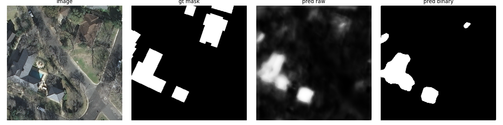
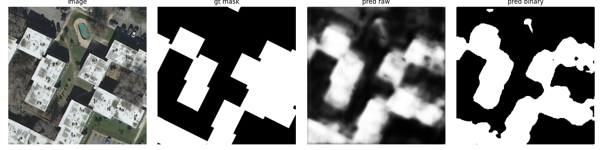
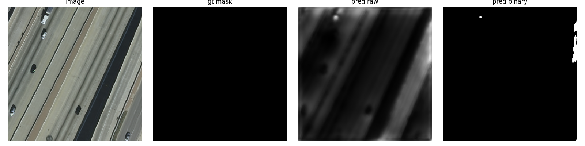
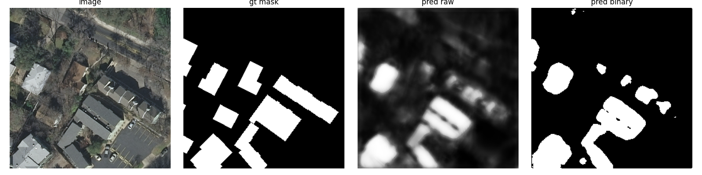
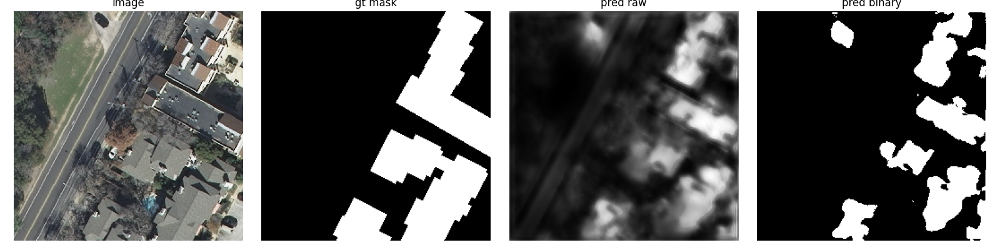
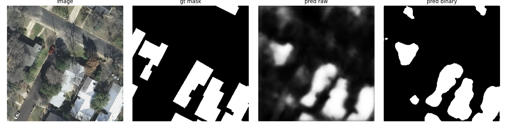
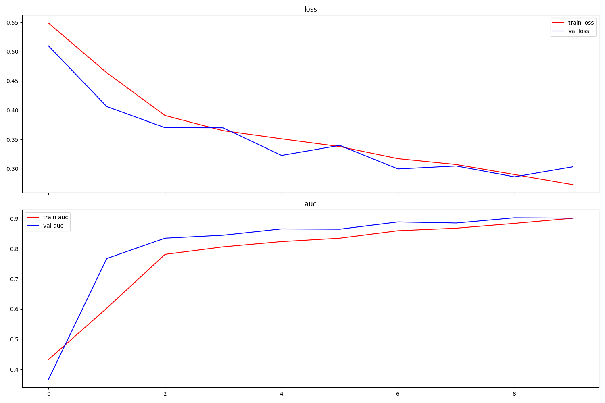

# Satellite Building Segmentation

Made in 2023, updated in 2026 U-Net for binary segmentation of buildings in aerial/satellite imagery (Inria dataset).

## Predictions

| | | |
|---|---|---|
|  |  |  |
|  |  |  |

Each row: input patch · ground truth mask · raw prediction · binary mask.

## Training curves



---

## Dataset

[Inria Aerial Image Labeling](https://www.kaggle.com/datasets/sagar100rathod/inria-aerial-image-labeling-dataset) — large RGB `.tif` images (~5000×5000 px) with binary building masks.


---

## Install

Python 3.10+.

```bash
pip install kaggle tensorflow opencv-python-headless tifffile kagglehub \
            numpy matplotlib scikit-image shapely
```

---

## Run

```bash
python main.py
```

1. Downloads dataset via `kagglehub` (cached after first run)
2. Crops 256×256 patches from first 5 images (80/20 split)
3. Trains 10 epochs, saves best checkpoint (`val_auc`) to `segmentation_inria.h5`
4. Saves results to `results/`

---

## Files

| File | What it does |
|---|---|
| `main.py` | Full pipeline: download → crop → train → save results |
| `unet_sat.py` | U-Net model, data generators, mask↔polygon conversion |
| `rearrange.py` | Splits flat `img/` + `mask/` into train/val/test subfolders |
| `dsgen.py` | Rotation-augmented crop generator for custom datasets |
| `rot_api.py` | `rotate_image`, `largest_rotated_rect`, `crop_around_center` |

---

## Model

Lightweight U-Net, base channels = 8.  
Input: 256×256 RGB. Output: sigmoid mask.  
Loss: binary cross-entropy. Metric: AUC. Optimizer: Adam (lr=1e-3, ×0.9 every 2 epochs).
